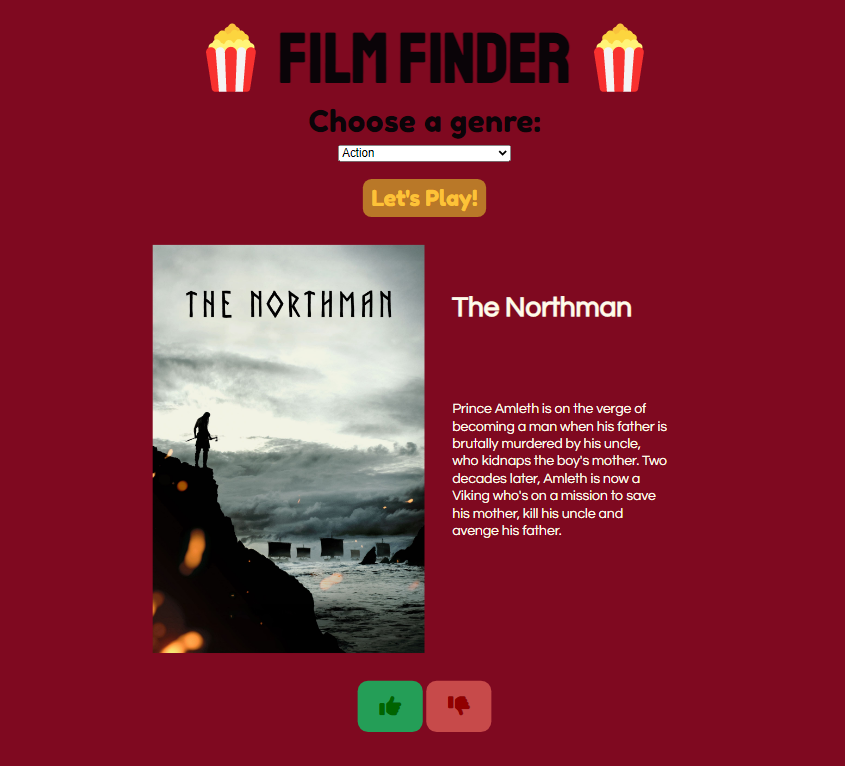

# Film Finder 🍿

## Description 

A JavaScript project from Codecademy's Front End Engineer career path.

In this project, I am using HTTP requests and asynchronous JavaScript to create a movie discovery app that will recommend random movies by genre. You’ll be able to choose from several genres, and like or dislike a movie to get another suggestion.

Obfuscating the API key was outside the scope of this project, so my key is publicly available. Best practice would be to build a back-end or middleware in order to keep the key private. 

## Snapshot 

## Site Link
[Film Finder](https://chloeharris1.github.io/film-finder/)

## License
Licensed under the MIT license.

## Credits 
Popcorn favicon from [Freepik](https://www.flaticon.com/free-icon/popcorn_3409593?term=popcorn%20movie%20cinema&page=1&position=35&page=1&position=35&related_id=3409593&origin=tag#).

## Questions 
[Email Me](Chloe.a.harris17@gmail.com) if you have any questions.

Check out more of my work on [GitHub](https://github.com/chloeharris1).

